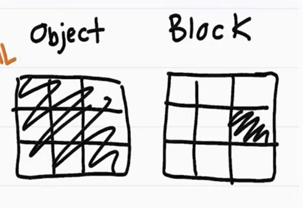
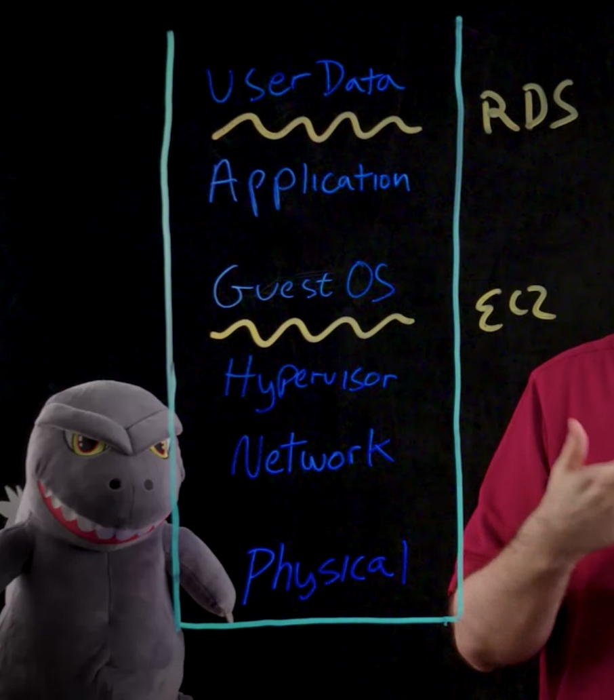

# AWS Fundamentals - 1: Infrastructure and Compute
## Infrastructure:
Choose the right region has to do with the following factors:
- Latency: 
- Cost 
- Compliance (legal restriction)
- Service availability 

## Compute 
Details about the full range of AWS compute services can be found [here](https://aws.amazon.com/products/compute/).
### EC2
Amazon Elastic Compute Cloud(EC2) is a compute service that allows you to provision virtual servers on demand. Each virtual server you provision is called an EC2 instance. 
Process of launching an EC2 instance:
1. EC2
2. Launch instance
3. Choose an AMI(Amazon Machine Image): operating system, web server,...
4. Choose instance type: what is controlling the underline hardware
5. config
6. Add storage
7. Add tags
8. Configure security group 
9. Review and launch

### Amazon Lightsail 
---
#AWS Fundamentals - 2. Networking and Storage 
## Networking
### Virtual Private Cloud (VPC)
To build the VPC, you only have to declare two specific things: what Region you're selecting, and then the IP range for the private IPs of everything that's going to run inside this VPC. 
After creating a VPC, we have to add a gateway, and the gateway is called the internet gateway, or the IGW. 
1. create the internet gateway, 
2. attach it to the VPC 3.
3. create a route table and associate that with the subnet

so that any communication that wants to talk to assets in this subnet, can come in and out of that IGW.

To test it, create an EC2 instance that is running in the VPC.

Create a private subnet, and deploy the database into it, so that nobody else can access to the database from the internet. 

####CIDR Notation
An important concept that's used in networking on AWS is CIDR, or Classless Inter-Domain Routing. CIDR network addresses are allocated in a virtual private cloud (VPC) and in a subnet by using CIDR notation. A /16 block provides 65,536 IPv4 addresses. A /24 block provides 256 addresses. See this article for more information about CIDR.

####Amazon Virtual Private Cloud
Amazon Virtual Private Cloud (Amazon VPC) lets you provision a logically isolated section of the AWS Cloud where you can launch AWS resources in a virtual network that you define. You have complete control over your virtual networking environment, including the selection of your own IP address range, the creation of subnets, and the configuration of route tables and network gateways. You can use both IPv4 and IPv6 in your VPC for secure and easy access to resources and applications. You could create up to five non-default VPCs per AWS account per Region. (See below for information about default VPCs.)

Details on Amazon VPC can be found here: [https://aws.amazon.com/vpc]()

####Subnets
A VPC spans all the Availability Zones in the Region. After creating a VPC, you can add one or more subnets in each Availability Zone. When you create a subnet, you specify the CIDR block for the subnet, which is a subset of the VPC CIDR block. Each subnet must reside entirely within one Availability Zone, and it can't span Availability Zones.

This is an important fundamental topic, and we strongly recommend that you review the information at: https://docs.aws.amazon.com/vpc/latest/userguide/VPC_Subnets.html

Security in a VPC is provided by using Security Groups and Network Access Control Groups. We will talk about AWS Security in a later module.

####Default VPC
In each Region, AWS will provision a default VPC. This VPC has a /16 IPv4 CIDR address block of 172.31.0.0/16. This provides 65,536 private IPv4 addresses. In addition, there will be a /20 subnet that is created for each Availability Zone in the Region, which provides 4,096 addresses per subnet, with a few addresses reserved for AWS usage. The route table that is associated with the default VPC will have a public route, which in turn is associated with a provisioned internet gateway.

You can modify or delete the default VPC if you want to do so.

The most current details on the default VPC can be found here: https://docs.aws.amazon.com/vpc/latest/userguide/default-vpc.html

## Storage 
### S3
S3 is object level storage.
There are two types of storage: object level and block level storage.

If you have an image, like we have here, and you want to update that image, you have to update the entire file. So the whole file's going to change. In contrast, databases like Amazon RDS run on top of block-level storage.

How this works is if we wanted to change the location for a contact, we could just change the corresponding blocks. We do not need to update the entire data file for every single change. For object storage, we use Amazon S3. This provides highly durable and scalable stores for items like images, videos, text files, and more.

Storage for databases and EC2 instances use block-level storage, like Amazon Elastic Block Storage, or EBS. For file storage and shared file systems, we offer Amazon Elastic File System, or Amazon EFS.

### Elastic Block Storage (EBS)

Amazon Elastic Block Store (Amazon EBS) provides persistent block storage volumes for use with Amazon EC2 instances in the AWS Cloud. 

### S3
Amazon Simple Storage Service (Amazon S3) stores data as objects within resources that are called buckets. You can store as many objects as you want within a bucket, and you can write, read, and delete objects in your bucket. Objects can be up to 5 TB in size.

# AWS Fundamentals - 3: Database
### BYODB vs Amazon RDS
### DynamoDB
Amazon DynamoDB is a fast and flexible NoSQL database service for applications that need consistent, single-digit millisecond latency at any scale. Its a fully managed cloud database, and it supports both document and key-value store models. Its flexible data model, reliable performance, and automatic scaling of throughput capacity make it a great fit for mobile, web, gaming, advertising technology (ad tech), Internet of Things (IoT), and many other applications.
### S3
# AWS Fundamentals - 4: Monitoring and Scaling Our Application
## Monitoring and Amazon CloudWatch

#Security and Cost Management 
## Security

## Cost Management 
### AWS Trusted Advisor
AWS Trusted Advisor is an online resource to help you reduce costs, increase performance, and improve security by optimizing your AWS environment. Trusted Advisor provides real-time guidance to help you provision your resources by following our best practices. 
